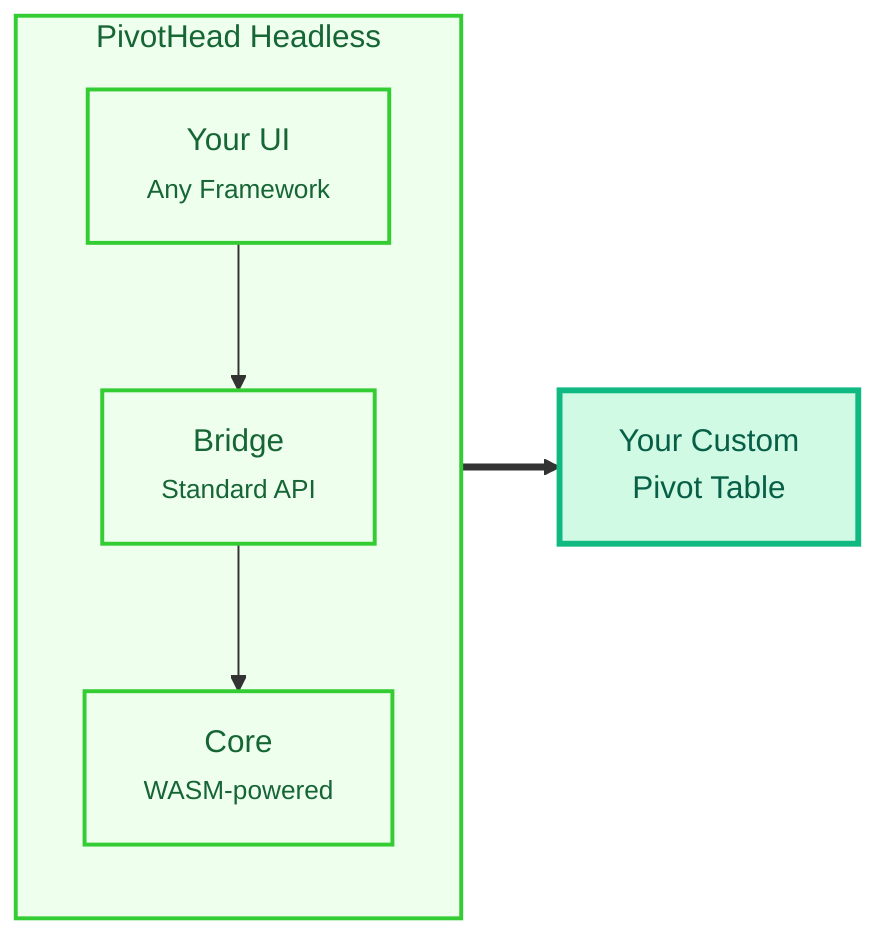

# How We Built a 37x Faster CSV Parser with a Headless Engine and WebAssembly

In the world of data visualization, pivot tables are a powerful tool for summarizing and analyzing large datasets. However, developers often face a trade-off: either use a pre-built library that sacrifices UI flexibility for ease of use, or build a custom solution from scratch, which can be a complex and time-consuming endeavor. Furthermore, as datasets grow, performance becomes a critical concern, with browsers struggling to handle the computational load of parsing and aggregating millions of data points.

This is the story of how we tackled these challenges with PivotHead, a headless pivot table library that leverages the power of WebAssembly (WASM) to deliver blazing-fast performance without compromising on developer freedom.

## The Power of a Headless Architecture

The first problem we wanted to solve was the lack of UI flexibility in existing pivot table libraries. We wanted to give developers complete control over the look and feel of their pivot tables, allowing them to seamlessly integrate them into their existing design systems. The solution was to adopt a **headless architecture**.

A headless library provides all the backend logic without shipping a pre-built, styled user interface. Think of it as a powerful car engine without the car's body. You get all the performance and functionality, with complete freedom to design the vehicle around it.

This approach has several key advantages:

- **Ultimate UI Flexibility**: You are not locked into a specific table design. Build custom tables, grids, charts, or any other visualization that fits your application's design system perfectly.
- **Framework Agnostic**: The core engine is pure TypeScript, making it compatible with any JavaScript framework (React, Vue, Svelte, Angular) or even vanilla JavaScript.
- **Better Performance**: By separating data logic from rendering, your application can perform complex calculations without being slowed down by UI updates. You control the rendering strategy.
- **Seamless Integration**: Easily integrate PivotHead into your existing component libraries and design systems without fighting against pre-defined styles.

Our architecture is composed of three layers:

1.  **Core Engine (`@pivothead/core`)**: The brain of PivotHead - pure TypeScript logic with zero UI dependencies.
2.  **Web Component Layer (`@pivothead/webcomponent`)**: The bridge between your UI and the core engine, exposing a standardized API.
3.  **Framework Wrappers (Optional)**: Pre-built, framework-specific integrations for React, Vue, and Angular.



## The Quest for Performance: Why WebAssembly?

With the architecture in place, we turned our attention to performance. Processing large CSV files in the browser has always been a challenge. A 100MB file can easily freeze the UI, leading to a frustrating user experience. We knew we needed a solution that could handle large datasets with ease.

Enter **WebAssembly (WASM)**.

WebAssembly is a binary instruction format that runs in modern web browsers at near-native speed. For compute-intensive tasks like CSV parsing, it can be significantly faster than JavaScript.

Think of it like this:

- **JavaScript** is like a chef reading a recipe line by line, interpreting as they go.
- **WebAssembly** is like a chef who has already memorized the recipe and can execute it flawlessly at high speed.

CSV parsing involves a lot of character counting, number parsing, and type detection—all tasks where WASM excels.

## Our Three-Tier Performance Architecture

To make the most of WebAssembly, we designed a **three-tier performance architecture** that intelligently routes files through different processing pipelines based on their size and complexity.

| Tier       | File Size | Technology          | When to Use                   | Speedup       |
| ---------- | --------- | ------------------- | ----------------------------- | ------------- |
| **Tier 0** | < 1 MB    | Standard JavaScript | Small files, simple data      | 1x (baseline) |
| **Tier 1** | 1-5 MB    | Web Workers         | Medium files, multi-core CPU  | 5x faster     |
| **Tier 2** | 5-8 MB    | Pure WASM           | Medium-large files, max speed | 10x faster    |
| **Tier 3** | > 8 MB    | Streaming + WASM    | Large files, memory efficient | 37x faster    |

This automatic selection process ensures that you always get the best possible performance without any configuration.

The results speak for themselves. For a 21.38MB CSV file with 100,000 rows, our WASM-powered parser is **10x faster** than standard JavaScript, reducing the parse time from 8.5 seconds to just 0.85 seconds.

But the benefits don't stop there. When you consider the entire processing pipeline, from file read to engine update, the speedup is even more dramatic. For the same 100,000-row dataset, the complete pipeline is **20.6x faster** with WASM, reducing the total time from 56.6 seconds to a mere 2.75 seconds!

## The Hybrid Approach: Getting the Best of Both Worlds

To achieve these results, we adopted a **hybrid WASM + JavaScript approach**, where each technology does what it does best.

- **WASM Responsibilities (Fast Compute)**:
  - Parsing CSV structure (counting rows and columns)
  - Detecting data types (number, string, boolean)
  - Parsing numbers
- **JavaScript Responsibilities (Complex Logic)**:
  - Handling complex string manipulation (e.g., quoted fields)
  - Creating dynamic JavaScript objects
  - Error handling

This hybrid model allows us to leverage the raw speed of WASM for the heavy lifting, while still benefiting from the flexibility and rich feature set of JavaScript for the more complex parts of the process.

Here's a simplified view of our processing flow:

```
┌─────────────────────────────────────────────────────────┐
│  STEP 1: WASM Structure Analysis (FAST!)               │
│  Result: { rowCount: 100000, colCount: 40 }     │
│  Time: 0.2s                                      │
└─────────────────────────────────────────────────────────┘
                         ↓
┌─────────────────────────────────────────────────────────┐
│  STEP 2: JavaScript Data Extraction (COMPLEX)          │
│  Handles: "Complex ""Quoted"" Fields"            │
│  Result: [["val1", "val2"], ...]                │
│  Time: 0.5s                                      │
└─────────────────────────────────────────────────────────┘
                         ↓
┌─────────────────────────────────────────────────────────┐
│  STEP 3: WASM Type Detection (FAST!)                   │
│  For each cell: detectFieldType(value) & parseNumber(value) │
│  Time: 0.15s for 4 million cells!              │
└─────────────────────────────────────────────────────────┘
                         ↓
┌─────────────────────────────────────────────────────────┐
│  STEP 4: JavaScript Object Creation                    │
│  Result: [{name: "John", age: 30}, ...]         │
│  Time: 0.3s                                      │
└─────────────────────────────────────────────────────────┘
                         ↓
              ┌──────────────────────┐
              │   TOTAL: 0.85s       │
              │   vs 8.5s in pure JS │
              │   = 10x FASTER!      │
              └──────────────────────┘
```

## Putting It All Together: A Real-World Example

Despite the complexity under the hood, using PivotHead is remarkably simple. Here's a basic example of how you can use it in a React application:

```javascript
import { PivotEngine } from '@mindfiredigital/pivothead';
import { usePivot } from '@mindfiredigital/pivothead-react';

function MyPivotTable() {
  const rawData = [
    { country: 'USA', category: 'Electronics', sales: 1500 },
    { country: 'Canada', category: 'Cars', sales: 1800 },
    // ... more data
  ];

  const { data, config, update } = usePivot(rawData, {
    rows: [{ uniqueName: 'country', caption: 'Country' }],
    columns: [{ uniqueName: 'category', caption: 'Category' }],
    measures: [
      { uniqueName: 'sales', caption: 'Total Sales', aggregation: 'sum' },
    ],
  });

  // Render the pivot table using your own components
  return (
    <table>
      <thead>{/* Render headers based on config */}</thead>
      <tbody>{/* Render rows based on data */}</tbody>
    </table>
  );
}
```

And if you need to load a large CSV file, it's as simple as this:

```javascript
import { ConnectService } from '@mindfiredigital/pivothead';

const pivotEngine = new PivotEngine();

// Upload any CSV file - automatic optimization!
const result = await ConnectService.connectToLocalCSV(pivotEngine);

// The result contains performance data
console.log(`Mode Used: ${result.performanceMode}`);
console.log(`Parsed in ${result.parseTime}ms`);
```

The library automatically detects the file size and uses the optimal processing mode, whether it's standard JavaScript, Web Workers, or WebAssembly.

## Conclusion

By combining a headless architecture with a sophisticated, multi-tiered performance strategy centered around WebAssembly, PivotHead offers a unique solution for building high-performance, custom pivot tables. It empowers developers with the freedom to create any UI they can imagine, while providing the raw power to handle massive datasets with ease.

We believe this approach represents the future of data visualization on the web, and we're excited to see what the community will build with it.

**To learn more about PivotHead, check out our [documentation](https://pivothead.dev) and our [GitHub repository](https://github.com/mindfiredigital/PivotHead).**
