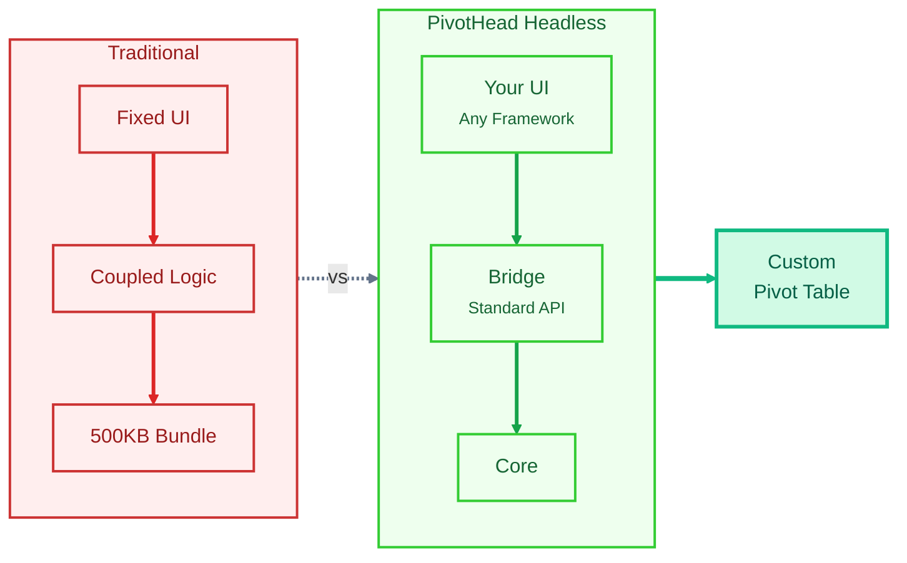

# Headless Architecture

import Tabs from '@theme/Tabs';
import TabItem from '@theme/TabItem';
import HeadlessArchitectureVisual from '@site/src/components/HeadlessArchitectureVisual';

## **What Makes PivotHead Special?**

**PivotHead is the first truly headless pivot table engine.** But what does "headless" really mean, and why does it matter for you?

### **What is a Headless Pivot Engine?**

A headless pivot engine separates the **data processing logic** from the **visual presentation**. Think of it like a powerful engine that does all the heavy lifting of pivot calculations, while giving you complete freedom to design the user interface however you want.

## **Understanding Headless Architecture**



## **Interactive Architecture Explorer**

Click on each layer to explore how PivotHead's architecture works:

<HeadlessArchitectureVisual />

---

### **1. Core Engine (`@pivothead/core`)**

The brain of PivotHead - pure TypeScript logic with zero UI dependencies.

**Responsibilities:**

- Data parsing and transformation
- Pivot calculations and aggregations
- Filtering, sorting, and grouping
- State management
- Performance optimization

### **2. Web Component Layer (`@pivothead/webcomponent`)**

The bridge between your UI and the core engine.

**Responsibilities:**

- Wraps core engine functionality
- Exposes standardized API
- Handles browser compatibility
- Manages lifecycle events

**Key Benefits:**

- Works in any framework
- Encapsulated functionality
- Easy integration
- No style conflicts

### **3. Framework Wrappers (Optional)**

Pre-built integrations for popular frameworks.

- `@pivothead/react` - React hooks and components
- `@pivothead/vue` - Vue composables and components
- `@pivothead/angular` - Angular directives and services

## Why Headless Matters

### Complete Design Freedom

```typescript
// You control EVERYTHING about the UI
<YourCustomTable>
  <YourCustomHeader />
  <YourCustomRows />
  <YourCustomAggregations />
  <YourCustomFilters />
</YourCustomTable>
```

### **Testability**

```typescript
// Test the engine logic independently
import { PivotEngine } from '@pivothead/core';

test('calculates correct sum', () => {
  const engine = new PivotEngine(data);
  expect(engine.getAggregation('sum', 'sales')).toBe(1000);
});
```

## **Real-World Example: Custom Dashboard**

Here's how you might use PivotHead's headless architecture to build a custom analytics dashboard:

```typescript
import { PivotEngine } from '@pivothead/core';
import { MyCustomCard } from './components';

function AnalyticsDashboard({ salesData }) {
  // Core engine handles all pivot logic
  const engine = new PivotEngine(salesData, {
    rows: ['region', 'product'],
    columns: ['quarter'],
    values: ['sales', 'profit']
  });

  // You control the presentation
  return (
    <div className="my-custom-dashboard">
      <MyCustomCard
        title="Q1 Performance"
        data={engine.getQuarterData('Q1')}
        style="gradient-red"
      />
      <MyCustomChart
        type="bar"
        data={engine.getRegionalBreakdown()}
      />
      <MyCustomTable
        data={engine.getFullPivot()}
        theme="dark"
      />
    </div>
  );
}
```

**Notice:** You're using the same powerful pivot engine, but the UI is 100% yours!

## **Getting Started with Headless**

### \*Quick Start\*\*

1. **Install the core engine:**

   ```bash
   npm install @pivothead/core
   ```

2. **Use it with your preferred framework:**

   ```bash
   # React
   npm install @pivothead/react

   # Vue
   npm install @pivothead/vue

   # Angular
   npm install @pivothead/angular

   # Or use vanilla JS with web components
   npm install @pivothead/webcomponent
   ```

3. **Build your UI:**

   ```typescript
   import { usePivot } from '@pivothead/react';

   function MyPivotTable() {
     const { data, config, update } = usePivot(rawData);

     // Render however you want!
     return <YourCustomUI data={data} />;
   }
   ```

## **When to Use Headless**

## Architecture Benefits Summary

| Feature               | Traditional Libraries | PivotHead Headless |
| --------------------- | --------------------- | ------------------ |
| **UI Flexibility**    | Limited               | Complete           |
| **Framework Support** | Usually 1-2           | Any framework      |
| **Customization**     | CSS overrides         | Full control       |
| **Testing**           | Coupled               | Independent layers |
| **Updates**           | Breaking UI changes   | Core logic stable  |
| **Learning Curve**    | Library-specific      | Standard web dev   |

---

**Remember:** With PivotHead, you're not locked into a specific UI. The engine does the hard work, and you create the perfect interface for your users. That's the power of headless architecture!
