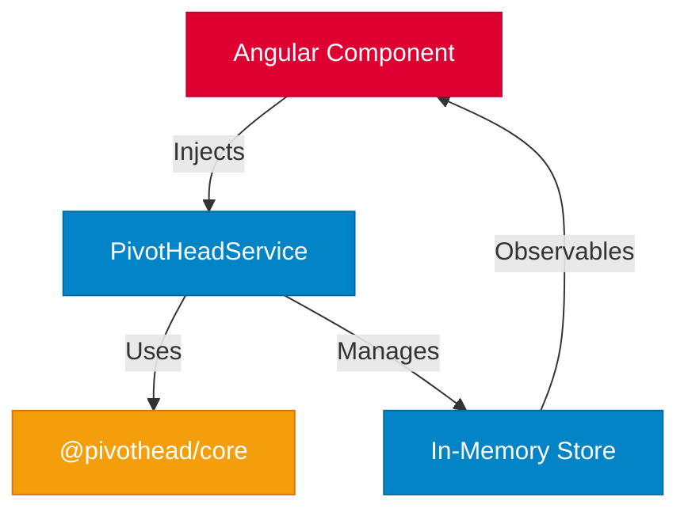

# 🚀 Upcoming Features

We're constantly working to make PivotHead even better! Here's what's coming in our next releases.

:::info Active Development
The features listed here are currently in development or planning stages. Release dates and specifications may change based on community feedback and priorities.
:::

---

## In Active Development

### Angular Support (Coming in next release)

**Status:** In Development

We're bringing full Angular support to PivotHead's headless architecture!

**What's Included:**

- Angular service integration
- Reactive directives
- TypeScript-first design
- Zone.js compatibility
- Angular CLI integration
- Standalone component support

**Quick Preview:**

```typescript
import { Component } from '@angular/core';
import { PivotHeadService } from '@pivothead/angular';

@Component({
  selector: 'app-sales-pivot',
  template: `
    <div *ngFor="let row of pivot.rows$ | async">
      {{ row.label }}: {{ row.total }}
    </div>
  `,
})
export class SalesPivotComponent {
  constructor(public pivot: PivotHeadService) {
    this.pivot.setData(salesData, {
      rows: ['product'],
      columns: ['region'],
      values: ['sales'],
    });
  }
}
```

[Learn more about Angular integration →](#angular-deep-dive)

---

### ⚡ High-Volume Data Processing (Coming in next release)

**Status:** Design Phase Complete

Handle millions of rows directly in the browser with our revolutionary client-side processing engine.

**Key Capabilities:**

- Process datasets **> 100MB** entirely in the browser
- WebAssembly-powered aggregations
- Streaming data ingestion with progressive rendering
- Columnar in-memory storage for blazing-fast operations
- Virtual scrolling for massive datasets

**Performance Targets:**

| Dataset Size      | Processing Time | Memory Usage |
| ----------------- | --------------- | ------------ |
| 1 MB (50K rows)   | < 100ms         | ~5 MB        |
| 10 MB (500K rows) | < 1s            | ~30 MB       |
| 100 MB (5M rows)  | < 5s            | ~200 MB      |
| 500 MB (25M rows) | < 30s           | ~800 MB      |

[View detailed specification →](#high-volume-specification)

---

## Planned Features

### Advanced Customization

- **Conditional Formatting API**: Color cells based on values, thresholds, or formulas
- **Custom Cell Renderers**: Inject your own components for any cell
- **Theme System**: Pre-built themes with easy customization
- **Export Templates**: Customizable PDF and Excel export layouts

### Enhanced Filtering

- **Date Range Picker**: Built-in date filtering UI
- **Search Across Fields**: Full-text search in pivot data
- **Filter History**: Undo/redo filter changes
- **Saved Filter Sets**: Save and restore filter combinations

### Advanced Calculations

- **Running Totals**: Cumulative calculations
- **Moving Averages**: Time-window aggregations
- **Percentage of Total**: Row/column/grand total percentages
- **Custom Formulas**: Excel-like formula language
- **Year-over-Year**: Automatic period comparisons

---

## Angular Deep Dive {#angular-deep-dive}

### Architecture



### Features

#### 1. Reactive Service

```typescript
import { Injectable } from '@angular/core';
import { BehaviorSubject, Observable } from 'rxjs';

@Injectable({
  providedIn: 'root',
})
export class PivotHeadService {
  private data$ = new BehaviorSubject<any[]>([]);
  private config$ = new BehaviorSubject<PivotConfig>({});

  // Reactive data streams
  readonly rows$: Observable<Row[]>;
  readonly columns$: Observable<Column[]>;
  readonly totals$: Observable<Totals>;

  // Methods
  setData(data: any[], config: PivotConfig): void;
  updateConfig(config: Partial<PivotConfig>): void;
  applyFilter(field: string, values: any[]): void;
  export(format: 'csv' | 'excel'): Promise<Blob>;
}
```

#### 2. Directives

```typescript
// Pivot Table Directive
<table pivotHead [data]="salesData" [config]="pivotConfig">
  <thead>
    <tr *pivotColumns="let col">
      <th>{{ col.label }}</th>
    </tr>
  </thead>
  <tbody>
    <tr *pivotRows="let row">
      <td>{{ row.label }}</td>
      <td *pivotCells="let cell">{{ cell.value | number }}</td>
    </tr>
  </tbody>
</table>
```

#### 3. Standalone Components

```typescript
import { PivotTableComponent } from '@pivothead/angular';

@Component({
  standalone: true,
  imports: [PivotTableComponent],
  template: `
    <pivot-table
      [data]="data"
      [rows]="['product']"
      [columns]="['region']"
      [values]="['sales']"
      (cellClick)="onCellClick($event)"
    />
  `,
})
export class DashboardComponent {}
```

---

## **High-Volume Data Processing Specification {#high-volume-specification}**

### Architecture Components

#### 1. Main Thread

**Responsibilities:**

- UI rendering and virtual scrolling
- User interaction handling
- Worker coordination
- Progressive result merging

```typescript
class MainThreadController {
  private workerPool: WorkerPool;
  private resultMerger: IncrementalMerger;

  async loadLargeDataset(file: File): Promise<void> {
    const chunks = this.createChunks(file, CHUNK_SIZE);

    for await (const chunk of chunks) {
      const worker = await this.workerPool.getAvailableWorker();
      worker.postMessage({ type: 'PARSE_CHUNK', data: chunk });

      // Progressive update
      this.updateProgress(chunk.processedBytes / file.size);
    }
  }
}
```

#### 2. Web Worker Pool

**Responsibilities:**

- Parallel data parsing
- Incremental aggregation
- Delta calculation
- WebAssembly execution

**Configuration:**

```typescript
interface WorkerConfig {
  workerCount: number;
  chunkSizeBytes: number;
  useWasm: boolean;
  maxRawRowRetention: number;
}
```

#### 3. WebAssembly Modules

**When to Use:**

- Dataset size > 5 MB
- Row count > 100,000
- Complex aggregations

**Performance Gains:**

- **3-5x faster** parsing
- **5-10x faster** aggregations
- **50% less** memory usage

### Data Ingestion Pipeline

```typescript
// 1. Chunked Streaming
async function* streamFile(file: File, chunkSize: number) {
  const reader = file.stream().getReader();
  let buffer = new Uint8Array();

  while (true) {
    const { done, value } = await reader.read();
    if (done) break;

    buffer = concatenate(buffer, value);

    while (buffer.length >= chunkSize) {
      yield buffer.slice(0, chunkSize);
      buffer = buffer.slice(chunkSize);
    }
  }

  if (buffer.length > 0) yield buffer;
}

// 2. Worker Dispatch
for await (const chunk of streamFile(file, CHUNK_SIZE)) {
  const worker = await workerPool.acquire();
  worker.postMessage({
    type: 'PARSE_AND_AGGREGATE',
    chunk,
    schema,
    pivotConfig,
  });
}

// 3. Incremental Merge
worker.onmessage = event => {
  const { delta, progress } = event.data;
  resultMerger.mergeDelta(delta);
  ui.updateProgress(progress);
  ui.refreshViewport();
};
```

### Virtualized Rendering

```typescript
class VirtualScrollRenderer {
  private viewportHeight: number;
  private rowHeight: number;
  private totalRows: number;

  getVisibleRange(): [number, number] {
    const scrollTop = this.container.scrollTop;
    const startIndex = Math.floor(scrollTop / this.rowHeight);
    const endIndex = Math.ceil(
      (scrollTop + this.viewportHeight) / this.rowHeight
    );

    return [startIndex, endIndex];
  }

  render() {
    const [start, end] = this.getVisibleRange();
    const visibleData = this.store.slice(start, end);

    // Render only visible rows
    this.renderRows(visibleData, start);

    // Update scroll spacers
    this.updateSpacers(start, end, this.totalRows);
  }
}
```

### Memory Management

```typescript
class MemoryManager {
  private rawBuffers: Map<string, ArrayBuffer>;
  private aggregatedCache: Map<string, AggResult>;

  processChunk(chunk: Chunk): void {
    // Parse and aggregate immediately
    const result = this.parseAndAggregate(chunk);

    // Release raw buffer if not needed for drill-down
    if (!this.needsDrillDown(chunk.id)) {
      this.rawBuffers.delete(chunk.id);
    }

    // Cache aggregated result
    this.aggregatedCache.set(chunk.id, result);
  }

  cleanupMemory(): void {
    // Remove buffers for collapsed nodes
    for (const [id, buffer] of this.rawBuffers) {
      if (!this.isExpanded(id)) {
        this.rawBuffers.delete(id);
      }
    }
  }
}
```

### Configuration Options

```typescript
const config: HighVolumeConfig = {
  // Data Processing
  chunkSizeBytes: 1024 * 1024, // 1MB chunks
  workerCount: navigator.hardwareConcurrency - 1,
  useWasm: true, // Auto-enable

  // Memory Management
  maxRawRowRetention: 10_000,
  enableCompression: true,
  compressionThreshold: 5 * 1024 * 1024, // 5MB

  // Virtual Scrolling
  rowHeight: 32,
  overscanCount: 5,

  // Performance Tuning
  batchSize: 1000,
  debounceMs: 16,

  // Monitoring
  enableMetrics: true,
  logLevel: 'info',
};
```

### Performance Monitoring

```typescript
interface PerformanceMetrics {
  // Parsing
  chunkParseTime: number[];
  totalParseTime: number;

  // Aggregation
  aggregationTime: number[];

  // WebAssembly
  wasmLoadTime: number;
  wasmExecutionTime: number;

  // Memory
  peakMemoryUsage: number;
  currentMemoryUsage: number;

  // Rendering
  fps: number;
  frameDrops: number;
}

// Usage
pivotHead.on('metrics', (metrics: PerformanceMetrics) => {
  console.log('Parse time:', metrics.totalParseTime);
  console.log('Memory:', metrics.currentMemoryUsage);
  dashboard.updateMetrics(metrics);
});
```

### Usage Example

```typescript
import { PivotHead, HighVolumeConfig } from '@pivothead/core';

// Initialize with high-volume config
const pivot = new PivotHead({
  ...HighVolumeConfig,
  workerCount: 4,
  useWasm: true,
});

// Load large file
const file = document.querySelector('input[type="file"]').files[0];

pivot
  .loadFile(file, {
    rows: ['category', 'product'],
    columns: ['year', 'quarter'],
    values: ['sales', 'profit'],
    aggregation: 'sum',
  })
  .on('progress', percent => {
    console.log(`Loading: ${percent}%`);
  })
  .on('chunk-processed', stats => {
    console.log('Processed chunk:', stats);
  })
  .on('complete', result => {
    console.log('Dataset loaded:', result);
    // Data is ready, UI is already updated progressively
  });
```

---

## Community Input

We value your feedback! Help shape PivotHead's future:

Which feature would help you most?

1. **Angular Support** - Full Angular integration
2. **High-Volume Processing** - Handle 100MB+ datasets
3. **Advanced Calculations** - Complex formulas and computations
4. **Real-Time Updates** - Live data streaming
5. **Enhanced Export** - Better PDF/Excel exports

---

## **Stay Updated**

### **Get Notified**

- **Star** our [GitHub repo](https://github.com/mindfiredigital/PivotHead)

---
