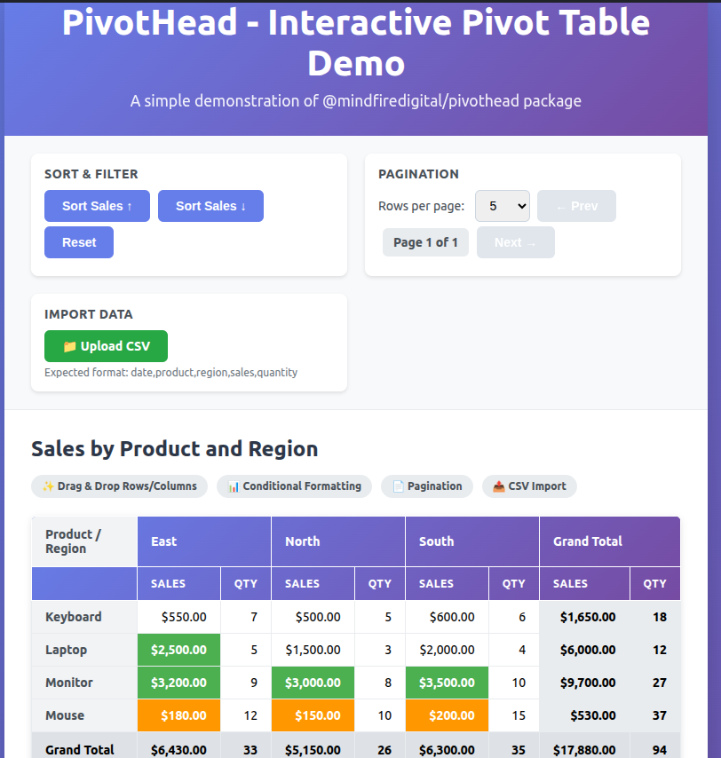

<div align="center">

# PivotHead React

**High-Performance Pivot Tables for React Applications**

[](https://www.npmjs.com/package/@mindfiredigital/pivothead-react)
[](https://opensource.org/licenses/MIT)
[](https://www.typescriptlang.org/)
[](https://github.com/mindfiredigital/PivotHead/pulls)

[Features](#-features) • [Installation](#-installation) • [Quick Start](#-quick-start) • [Documentation](#-documentation) • [Examples](#-examples) • [Support](#-support)

</div>

---

## Screenshots



> **🚀 Try it live**: [Interactive Demo](https://stackblitz.com/edit/vitejs-vite-osugvxpw?file=readme.md) | [Example Projects](../../examples/react-demo)

---

## Features

<table>
<tr>
<td width="33%" valign="top">

### **React-First Design**

- Native React hooks support
- TypeScript definitions included
- Full SSR compatibility
- Optimized re-rendering

</td>
<td width="33%" valign="top">

### **WebAssembly Powered**

- Process CSV files up to **1GB**
- 10x faster than pure JavaScript
- Automatic performance optimization
- Zero configuration required

</td>
<td width="33%" valign="top">

### **Flexible Rendering**

- **Default Mode**: Full UI included
- **Minimal Mode**: Slot-based customization
- **Headless Mode**: Complete control
- Custom themes support

</td>
</tr>
<tr>
<td width="33%" valign="top">

### **Rich Features**

- Drag-and-drop field management
- Dynamic aggregations
- Advanced filtering
- Multi-level grouping

</td>
<td width="33%" valign="top">

### **Developer-Friendly**

- Simple API
- Comprehensive docs
- Full TypeScript support
- Extensive examples

</td>
<td width="33%" valign="top">

### **Framework Agnostic Core**

- Works with React 17+
- Compatible with Next.js
- Remix support
- Vite optimized

</td>
</tr>
</table>

---

## Installation

```bash
# npm
npm install @mindfiredigital/pivothead-react

# yarn
yarn add @mindfiredigital/pivothead-react

# pnpm
pnpm add @mindfiredigital/pivothead-react
```

### Requirements

- **React**: 17.0.0 or higher
- **TypeScript** (optional): 4.5.0 or higher
- **Node.js**: 12.0.0 or higher

---

## Quick Start

### Basic Example

```tsx
import { PivotHead } from '@mindfiredigital/pivothead-react';

// Your data
const salesData = [
  { product: 'Laptop', region: 'North', sales: 5000, quarter: 'Q1' },
  { product: 'Phone', region: 'South', sales: 3000, quarter: 'Q1' },
  { product: 'Tablet', region: 'East', sales: 2000, quarter: 'Q2' },
  // ... more data
];

// Configuration
const pivotOptions = {
  rows: ['product'],
  columns: ['region'],
  values: ['sales'],
};

export default function Dashboard() {
  return (
    <div>
      <h1>Sales Dashboard</h1>
      <PivotHead mode="default" data={salesData} options={pivotOptions} />
    </div>
  );
}
```

### Load Large CSV Files (WebAssembly)

```tsx
import { PivotHead } from '@mindfiredigital/pivothead-react';
import { useState } from 'react';

export default function CsvUploader() {
  const [fileData, setFileData] = useState<File | null>(null);

  const handleFileChange = (e: React.ChangeEvent<HTMLInputElement>) => {
    const file = e.target.files?.[0];
    if (file) {
      setFileData(file);
      // The component automatically uses WebAssembly for optimal performance
      // - Files < 8MB: Processed in-memory with WASM
      // - Files > 8MB: Streaming + WASM hybrid mode
    }
  };

  return (
    <div>
      <input type="file" accept=".csv" onChange={handleFileChange} />

      {fileData && (
        <PivotHead
          mode="default"
          data={fileData}
          onStateChange={e => {
            console.log('Performance mode:', e.detail.performanceMode);
            // Possible values: 'standard', 'workers', 'wasm', 'streaming-wasm'
          }}
        />
      )}
    </div>
  );
}
```

---

## Rendering Modes

### 1️ Default Mode (Full UI)

Complete pivot table with built-in interface, drag-and-drop, filters, and controls.

```tsx
<PivotHead mode="default" data={data} options={options} />
```

**Best for**: Quick implementation, prototyping, admin panels

---

### 2️ Minimal Mode (Customizable)

Component provides structure; you control the styling and layout.

```tsx
<PivotHead mode="minimal" data={data} options={options}>
  <div slot="header">{/* Your custom toolbar */}</div>
  <div slot="body">{/* Your custom table rendering */}</div>
</PivotHead>
```

**Best for**: Custom branding, unique designs, themed applications

---

### 3️ Headless Mode (Complete Control)

No UI rendered - full programmatic control via API and events.

```tsx
import { PivotHead } from '@mindfiredigital/pivothead-react';
import { useRef, useEffect, useState } from 'react';

export default function CustomPivot() {
  const pivotRef = useRef<HTMLElement>(null);
  const [state, setState] = useState(null);

  useEffect(() => {
    const handleStateChange = (e: CustomEvent) => {
      setState(e.detail);
    };

    pivotRef.current?.addEventListener('stateChange', handleStateChange);

    return () => {
      pivotRef.current?.removeEventListener('stateChange', handleStateChange);
    };
  }, []);

  return (
    <div>
      <PivotHead ref={pivotRef} mode="none" data={data} options={options} />

      {/* Build your own UI using the state */}
      {state && <YourCustomTable data={state.processedData} />}
    </div>
  );
}
```

**Best for**: Maximum flexibility, custom visualizations, advanced integrations

---

## Advanced Usage

### With TypeScript

```tsx
import { PivotHead } from '@mindfiredigital/pivothead-react';
import type {
  PivotTableState,
  PivotTableOptions,
} from '@mindfiredigital/pivothead';

interface SalesRecord {
  product: string;
  region: string;
  sales: number;
  date: string;
}

const options: PivotTableOptions = {
  rows: ['product'],
  columns: ['region'],
  values: ['sales'],
};

export default function TypedPivot() {
  const handleStateChange = (
    event: CustomEvent<PivotTableState<SalesRecord>>
  ) => {
    console.log('New state:', event.detail);
  };

  return (
    <PivotHead<SalesRecord>
      mode="default"
      data={salesData}
      options={options}
      onStateChange={handleStateChange}
    />
  );
}
```

### Using Component Methods

```tsx
import { PivotHead } from '@mindfiredigital/pivothead-react';
import { useRef } from 'react';

export default function MethodsExample() {
  const pivotRef = useRef<any>(null);

  const handleExportPDF = () => {
    pivotRef.current?.exportToPDF('sales-report');
  };

  const handleExportExcel = () => {
    pivotRef.current?.exportToExcel('sales-data');
  };

  const handleSort = (field: string) => {
    pivotRef.current?.sort(field, 'desc');
  };

  return (
    <div>
      <div className="toolbar">
        <button onClick={handleExportPDF}>Export PDF</button>
        <button onClick={handleExportExcel}>Export Excel</button>
        <button onClick={() => handleSort('sales')}>Sort by Sales</button>
      </div>

      <PivotHead ref={pivotRef} mode="default" data={data} options={options} />
    </div>
  );
}
```

### Real-Time Data Updates

```tsx
import { PivotHead } from '@mindfiredigital/pivothead-react';
import { useState, useEffect } from 'react';

export default function LiveDashboard() {
  const [data, setData] = useState([]);

  useEffect(() => {
    // Simulate real-time data updates
    const interval = setInterval(() => {
      fetch('/api/sales/latest')
        .then(res => res.json())
        .then(newData => setData(newData));
    }, 5000);

    return () => clearInterval(interval);
  }, []);

  return <PivotHead mode="default" data={data} options={options} />;
}
```

---

## Documentation

### Component Props

| Prop            | Type                               | Default     | Description                                        |
| --------------- | ---------------------------------- | ----------- | -------------------------------------------------- |
| `mode`          | `'default' \| 'minimal' \| 'none'` | `'default'` | Rendering mode                                     |
| `data`          | `Array \| File \| string`          | `[]`        | Data source (JSON array, CSV File, or JSON string) |
| `options`       | `PivotTableOptions \| string`      | `{}`        | Pivot configuration                                |
| `filters`       | `FilterConfig[] \| string`         | `[]`        | Active filters                                     |
| `pagination`    | `PaginationConfig \| string`       | `{}`        | Pagination settings                                |
| `onStateChange` | `(event: CustomEvent) => void`     | -           | Fired when state changes                           |

### Available Methods

Access methods via `ref`:

```tsx
const pivotRef = useRef<any>(null);

// Methods
pivotRef.current?.getState(); // Get current state
pivotRef.current?.refresh(); // Refresh the pivot table
pivotRef.current?.sort(field, dir); // Sort by field
pivotRef.current?.exportToPDF(name); // Export to PDF
pivotRef.current?.exportToExcel(name); // Export to Excel
pivotRef.current?.exportToHTML(name); // Export to HTML
```

### Events

| Event           | Payload           | Description                                        |
| --------------- | ----------------- | -------------------------------------------------- |
| `onStateChange` | `PivotTableState` | Triggered on any state change (sort, filter, etc.) |

---

## Examples

### Full Examples Repository

Check out complete working examples in the repository:

| Example           | Description                                | Path                                                                |
| ----------------- | ------------------------------------------ | ------------------------------------------------------------------- |
| **Default Mode**  | Full UI with all features enabled          | [react-web-component-demo](../../examples/react-web-component-demo) |
| **React Wrapper** | React-specific implementation              | [react-demo](../../examples/react-demo)                             |
| **CSV Upload**    | Large file processing with WASM            | [simple-js-demo](../../examples/simple-js-demo)                     |
| **Minimal Mode**  | Custom rendering with slots                | [pivothead-minimal-demo](../../examples/pivothead-minimal-demo)     |
| **Headless Mode** | Complete control for custom visualizations | [pivothead-none-demo](../../examples/pivothead-none-demo)           |

### Running Examples Locally

```bash
# Clone the repository
git clone https://github.com/mindfiredigital/PivotHead.git
cd PivotHead

# Navigate to React demo
cd examples/react-demo

# Install dependencies
pnpm install

# Start development server
pnpm dev
```

---

## Performance Benchmarks

| File Size | Processing Mode  | Load Time | Memory Usage  |
| --------- | ---------------- | --------- | ------------- |
| < 1 MB    | Standard         | ~50ms     | Low           |
| 1-8 MB    | Web Workers      | ~200ms    | Medium        |
| 8-100 MB  | WASM (in-memory) | ~800ms    | Medium        |
| 100MB-1GB | Streaming + WASM | ~3-5s     | Low (chunked) |

> All benchmarks run on Chrome 120, MacBook Pro M1, 16GB RAM

---

## Framework Integration

### Next.js

```tsx
// app/dashboard/page.tsx
'use client';

import dynamic from 'next/dynamic';

const PivotHead = dynamic(
  () => import('@mindfiredigital/pivothead-react').then(mod => mod.PivotHead),
  { ssr: false }
);

export default function DashboardPage() {
  return <PivotHead mode="default" data={data} options={options} />;
}
```

### Remix

```tsx
// app/routes/dashboard.tsx
import { PivotHead } from '@mindfiredigital/pivothead-react';
import { useLoaderData } from '@remix-run/react';

export async function loader() {
  const data = await fetchSalesData();
  return { data };
}

export default function Dashboard() {
  const { data } = useLoaderData();
  return <PivotHead mode="default" data={data} options={options} />;
}
```

---

## Support

If PivotHead helps your project, please consider:

- ⭐ [Star the repository](https://github.com/mindfiredigital/PivotHead)

---

## License

MIT © [Mindfiredigital](https://github.com/mindfiredigital)

---

<div align="center">

**Built with ❤️ by the [Mindfiredigital](https://www.mindfiredigital.com) team**

[GitHub](https://github.com/mindfiredigital/PivotHead) • [NPM](https://www.npmjs.com/package/@mindfiredigital/pivothead-react) • [Website](https://www.mindfiredigital.com)

</div>
