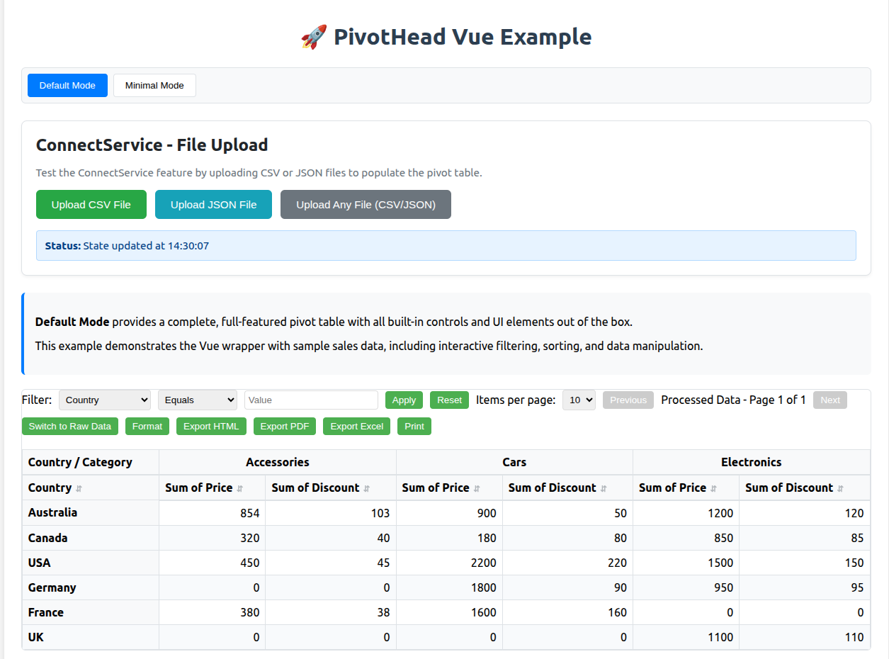

# PivotHead Vue

<div align="center">

**Lightning-fast, enterprise-grade pivot tables for Vue 3**

[](https://www.npmjs.com/package/@mindfiredigital/pivothead-vue)
[](https://vuejs.org/)
[](https://www.typescriptlang.org/)
[](https://github.com/mindfiredigital/pivothead)

_Built on WebAssembly for unparalleled performance_
[ Documentation](https://pivothead.mindfiredigital.com) • [ Live Demo](https://pivothead.mindfiredigital.com/demo) • [ Community](https://github.com/mindfiredigital/pivothead/discussions)

</div>

---

## Screenshots



> **🚀 Try it live**: Check out the [Vue examples](../../examples/vue-example) for working demos with Vue 3

---

## Why PivotHead?

PivotHead Vue is the **most performant** pivot table library for Vue 3, powered by cutting-edge WebAssembly technology. Process millions of rows in seconds, not minutes.

### Key Features

- **WebAssembly Acceleration** - 30-40% faster than pure JavaScript for large datasets
- **Streaming + WASM Hybrid** - Handle 800MB+ files with ease using intelligent chunking
- **Real-time Processing** - 10M+ rows parsed in ~25-30 seconds
- **Vue 3 Native** - Built specifically for Vue 3 with full Composition API support
- **Fully Responsive** - Beautiful UIs that work on any device
- **Multiple Modes** - Default, Minimal, and Headless modes for maximum flexibility
- **Smart Auto-Layout** - Automatically detects optimal pivot configuration
- **Zero Config CSV/JSON** - Drop files and go with ConnectService
- **Custom Formatting** - Currency, numbers, percentages, dates with locale support
- **Export Anywhere** - HTML, PDF, Excel, and print-ready formats
- **TypeScript First** - Complete type safety out of the box

---

## Performance Benchmarks

| Dataset Size | Mode                 | Processing Time | Memory Usage |
| ------------ | -------------------- | --------------- | ------------ |
| 100K rows    | Web Workers          | ~2.5s           | ~50MB        |
| 1M rows      | Web Workers          | ~8.5s           | ~200MB       |
| 10M rows     | **Streaming + WASM** | **~25-30s**     | **~400MB**   |
| 800MB CSV    | **Streaming + WASM** | **~43s**        | **~800MB**   |

_Tested on: Apple M1, 16GB RAM, Chrome 120_

** Up to 40% faster** than competing solutions for large datasets!

---

## Installation

```bash
npm install @mindfiredigital/pivothead-vue
```

### Requirements

- Vue 3.0.0 or higher
- Modern browser with WebAssembly support (Chrome, Firefox, Safari, Edge)

```bash
npm install @mindfiredigital/pivothead-vue vue@^3.0.0
```

---

## Quick Start

```vue
<template>
  <PivotHead
    :data="salesData"
    :options="pivotOptions"
    @state-change="handleStateChange"
  />
</template>

<script setup>
import { PivotHead } from '@mindfiredigital/pivothead-vue';

const salesData = [
  { country: 'USA', category: 'Electronics', sales: 15000, profit: 4500 },
  { country: 'USA', category: 'Clothing', sales: 8000, profit: 2400 },
  { country: 'UK', category: 'Electronics', sales: 12000, profit: 3600 },
  { country: 'UK', category: 'Clothing', sales: 6000, profit: 1800 },
];

const pivotOptions = {
  rows: [{ uniqueName: 'country', caption: 'Country' }],
  columns: [{ uniqueName: 'category', caption: 'Category' }],
  measures: [
    { uniqueName: 'sales', caption: 'Total Sales', aggregation: 'sum' },
    { uniqueName: 'profit', caption: 'Total Profit', aggregation: 'sum' },
  ],
};

const handleStateChange = state => {
  console.log('Pivot updated:', state);
};
</script>
```

---

## ConnectService - Smart File Loading

### Upload Massive Files with Zero Configuration

PivotHead automatically detects your data structure and creates the optimal pivot layout!

```vue
<template>
  <div>
    <button @click="uploadCSV" :disabled="isLoading">Upload CSV</button>
    <div v-if="uploadProgress > 0" class="progress-bar">
      {{ Math.round(uploadProgress) }}%
    </div>

    <PivotHead
      ref="pivotRef"
      :data="[]"
      :options="{}"
      @state-change="handleStateChange"
    />
  </div>
</template>

<script setup lang="ts">
import { ref } from 'vue';
import { PivotHead } from '@mindfiredigital/pivothead-vue';

const pivotRef = ref();
const isLoading = ref(false);
const uploadProgress = ref(0);

const uploadCSV = async () => {
  isLoading.value = true;

  const result = await pivotRef.value.connectToLocalCSV({
    onProgress: progress => {
      uploadProgress.value = progress;
    },
  });

  if (result.success) {
    console.log(` Loaded ${result.recordCount} rows`);
    console.log(` File: ${result.fileName} (${formatSize(result.fileSize)})`);
    console.log(`⚡ Mode: ${result.performanceMode}`); // 'streaming-wasm', 'wasm', 'workers', or 'standard'
  }

  isLoading.value = false;
  uploadProgress.value = 0;
};
</script>
```

### ConnectService Features

- **Automatic Mode Selection**
  - Small files (< 5MB): Standard mode
  - Medium files (5-50MB): Web Workers with parallel processing
  - Large files (50-100MB): WASM acceleration
  - Huge files (> 100MB): **Streaming + WASM hybrid mode**

- ** Smart Auto-Layout**
  - Detects field types (string, number, date, boolean)
  - Identifies dimensions vs measures
  - Applies intelligent defaults (low-cardinality → rows, high-cardinality → columns)
  - Creates aggregations automatically

- ** Supported Formats**

  ```typescript
  // CSV with custom options
  pivotRef.value.connectToLocalCSV({
    csv: {
      delimiter: ',',
      hasHeader: true,
      skipEmptyLines: true,
      trimValues: true,
    },
    maxRecords: 50000,
    onProgress: p => console.log(`${p}% done`),
  });

  // JSON with array path
  pivotRef.value.connectToLocalJSON({
    json: {
      arrayPath: 'data.records', // Supports nested paths
      validateSchema: true,
    },
    maxFileSize: 100 * 1024 * 1024, // 100MB
  });

  // Auto-detect format
  pivotRef.value.connectToLocalFile({
    onProgress: progress => updateUI(progress),
  });
  ```

### Performance Modes Explained

| Mode                 | When Used            | Speed            | Memory    |
| -------------------- | -------------------- | ---------------- | --------- |
| **Standard**         | < 5MB, < 10K rows    | Fast             | Low       |
| **Workers**          | 5-50MB, 10K-1M rows  | Very Fast        | Medium    |
| **WASM**             | 50-100MB, 1M-5M rows | **Ultra Fast**   | Medium    |
| **Streaming + WASM** | > 100MB, > 5M rows   | **Blazing Fast** | Optimized |

---

## Display Modes

### Default Mode - Full Featured

Complete pivot table with built-in controls, filtering, sorting, pagination, and export.

```vue
<PivotHead mode="default" :data="data" :options="options" />
```

**Perfect for:** Quick prototypes, dashboards, admin panels

### Minimal Mode - Customizable

Bring your own UI with slot-based customization.

```vue
<PivotHead mode="minimal" :data="data" :options="options">
  <template #header>
    <MyCustomToolbar />
  </template>
  <template #body>
    <MyCustomTable :state="pivotState" />
  </template>
</PivotHead>
```

**Perfect for:** Custom designs, branded experiences, fine-grained control

### Headless Mode - Maximum Control

Pure data engine with no UI - build anything you want!

```vue
<PivotHead
  mode="none"
  :data="data"
  :options="options"
  @state-change="handleStateChange"
/>
```

**Perfect for:** Custom visualizations, dashboards, data processing pipelines

---

## Advanced Features

### Real-time Formatting

```typescript
// Access via template ref
pivotRef.value.updateFieldFormatting('revenue', {
  type: 'currency',
  currency: 'USD',
  decimals: 2,
  thousandSeparator: ',',
  decimalSeparator: '.',
});

pivotRef.value.updateFieldFormatting('growth', {
  type: 'percentage',
  decimals: 1,
  percent: true,
});

pivotRef.value.updateFieldFormatting('lastUpdated', {
  type: 'date',
  locale: 'en-US',
});
```

### Dynamic Filtering

```vue
<template>
  <PivotHead :data="data" :options="options" :filters="activeFilters" />

  <button @click="addFilter">Filter USA Sales > $10,000</button>
</template>

<script setup>
import { ref } from 'vue';

const activeFilters = ref([]);

const addFilter = () => {
  activeFilters.value = [
    { field: 'country', operator: 'equals', value: 'USA' },
    { field: 'sum_sales', operator: 'greaterThan', value: 10000 },
  ];
};
</script>
```

### One-Click Exports

```typescript
// Export to Excel with formatting preserved
pivotRef.value.exportToExcel('Q4-2024-Sales-Report');

// Export to PDF
pivotRef.value.exportToPDF('Sales-Analysis');

// Export to HTML
pivotRef.value.exportToHTML('Pivot-Table');

// Print
pivotRef.value.openPrintDialog();
```

### Pagination & Virtual Scrolling

```vue
<PivotHead
  :data="millionRows"
  :options="options"
  :pagination="{ currentPage: 1, pageSize: 100, totalPages: 10000 }"
  @pagination-change="handlePageChange"
/>
```

For 10M+ rows, virtual scrolling is automatically enabled!

---

## Complete API Reference

### Props

| Prop         | Type                               | Default     | Description         |
| ------------ | ---------------------------------- | ----------- | ------------------- |
| `mode`       | `'default' \| 'minimal' \| 'none'` | `'default'` | Display mode        |
| `data`       | `Array<Record<string, any>>`       | `[]`        | Source data         |
| `options`    | `PivotOptions`                     | `{}`        | Pivot configuration |
| `filters`    | `FilterConfig[]`                   | `[]`        | Active filters      |
| `pagination` | `Partial<PaginationConfig>`        | -           | Pagination state    |
| `class`      | `string`                           | -           | CSS class           |
| `style`      | `object \| string`                 | -           | Inline styles       |

### Events

| Event                | Payload                          | Description                    |
| -------------------- | -------------------------------- | ------------------------------ |
| `@state-change`      | `PivotTableState`                | Fired when pivot state changes |
| `@view-mode-change`  | `{ mode: 'raw' \| 'processed' }` | View mode toggled              |
| `@pagination-change` | `PaginationConfig`               | Page changed                   |

### Methods (via Template Ref)

```typescript
interface PivotHeadMethods {
  // Data Access
  getState(): PivotTableState;
  getData(): PivotDataRecord[];
  getProcessedData(): unknown;
  getGroupedData(): unknown[];
  getFilteredData(): PivotDataRecord[];
  getFilteredAndProcessedData(): PivotDataRecord[];

  // Data Manipulation
  refresh(): void;
  sort(field: string, direction: 'asc' | 'desc'): void;

  // Configuration
  setMeasures(measures: MeasureConfig[]): void;
  setDimensions(dimensions: Dimension[]): void;
  setGroupConfig(config: GroupConfig | null): void;

  // Filtering
  getFilters(): FilterConfig[];

  // Formatting
  formatValue(value: unknown, field: string): string;
  updateFieldFormatting(field: string, format: FormatOptions): void;
  getFieldAlignment(field: string): string;
  showFormatPopup(): void;

  // View Control
  setViewMode(mode: 'raw' | 'processed'): void;
  getViewMode(): 'raw' | 'processed';

  // Pagination
  getPagination(): PaginationConfig;
  previousPage(): void;
  nextPage(): void;
  setPageSize(size: number): void;
  goToPage(page: number): void;

  // Drag & Drop
  swapRows(from: number, to: number): void;
  swapColumns(from: number, to: number): void;

  // Export
  exportToHTML(fileName?: string): void;
  exportToPDF(fileName?: string): void;
  exportToExcel(fileName?: string): void;
  openPrintDialog(): void;

  // ConnectService - WASM Powered!
  connectToLocalCSV(options?: ConnectionOptions): Promise<FileConnectionResult>;
  connectToLocalJSON(
    options?: ConnectionOptions
  ): Promise<FileConnectionResult>;
  connectToLocalFile(
    options?: ConnectionOptions
  ): Promise<FileConnectionResult>;
}
```

---

## TypeScript Support

Full type safety with comprehensive TypeScript definitions:

```typescript
import type {
  PivotHeadProps,
  PivotHeadMethods,
  PivotDataRecord,
  PivotOptions,
  PivotTableState,
  FilterConfig,
  FormatOptions,
  PaginationConfig,
  ConnectionOptions,
  FileConnectionResult,
  MeasureConfig,
  Dimension,
  GroupConfig,
} from '@mindfiredigital/pivothead-vue';
```

---

## Architecture

```
@mindfiredigital/pivothead-vue (Vue 3 Wrapper)
    ↓
@mindfiredigital/pivothead-web-component (Web Component)
    ↓
@mindfiredigital/pivothead (Core Engine)
    ↓
WebAssembly CSV Parser (WASM Module) ⚡
```

### Why This Stack?

- **Vue Wrapper**: Seamless Vue 3 integration with reactivity
- **Web Component**: Universal compatibility, framework-agnostic core
- **Core Engine**: Pure TypeScript for maximum compatibility
- **WASM Module**: Blazing-fast CSV parsing (30-40% faster!)

---

## Browser Support

| Browser | Version | WASM Support | Notes            |
| ------- | ------- | ------------ | ---------------- |
| Chrome  | 57+     | Yes          | **Recommended**  |
| Firefox | 52+     | Yes          | Full support     |
| Safari  | 11+     | Yes          | Full support     |
| Edge    | 16+     | Yes          | Full support     |
| IE 11   | -       | Fallback     | Uses Web Workers |

_WASM gracefully falls back to Web Workers on unsupported browsers_

---

## ⚡ Performance Tips

### Optimize for Speed

```typescript
//  DO: Freeze large datasets to prevent Vue reactivity overhead
const data = Object.freeze(largeDataArray);

//  DO: Use pagination for 10K+ rows
const pagination = { pageSize: 100 };

//  DO: Debounce filters for real-time updates
import { debounce } from 'lodash';
const updateFilters = debounce(filters => {
  activeFilters.value = filters;
}, 300);

//  DON'T: Pass deeply reactive objects unnecessarily
// Instead, use JSON.parse(JSON.stringify(obj)) if needed
```

### Memory Optimization

```typescript
// For 100MB+ files, use streaming mode
const result = await pivotRef.value.connectToLocalCSV({
  maxRecords: 50000, // Limit rows for better UX
  useWorkers: true, // Enable parallel processing
  chunkSizeBytes: 5 * 1024 * 1024, // 5MB chunks
});
```

---

## Contributing

We welcome contributions! See [CONTRIBUTING.md](../../CONTRIBUTING.md) for guidelines.

---

## License

MIT © [Mindfire Digital](https://mindfiredigital.com)

---

## Links

- [Full Documentation](https://pivothead.mindfiredigital.com)
- [Interactive Demos](https://pivothead.mindfiredigital.com/demo)
- [Community Forum](https://github.com/mindfiredigital/pivothead/discussions)
- [Report Issues](https://github.com/mindfiredigital/pivothead/issues)
- [npm Package](https://www.npmjs.com/package/@mindfiredigital/pivothead-vue)

---
